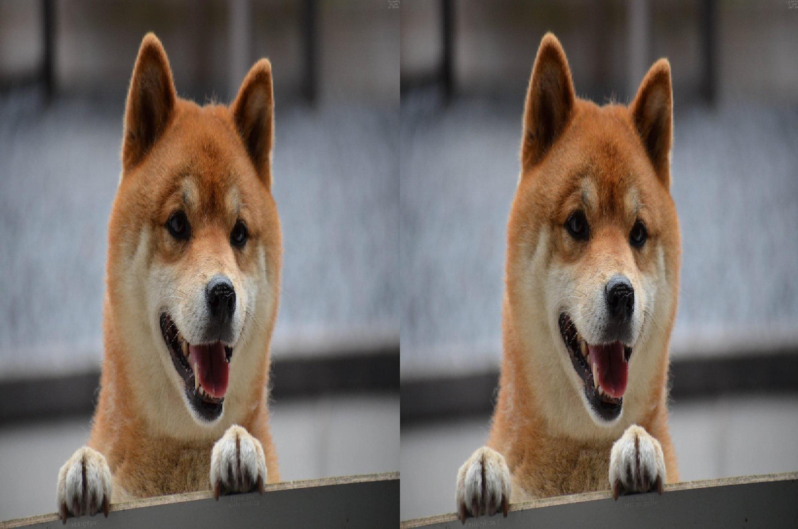

# Python Paper Cutter 📄

I came across this [video on imgur](https://imgur.com/w59YRy5) and I liked the idea behind it, so I implmented the same concept in python3.

# Screenshots 📸

What's better than a doggo? Multiple doggos!

### original

### Outputs

# Usage
> `python3 paper_cutter.py`
